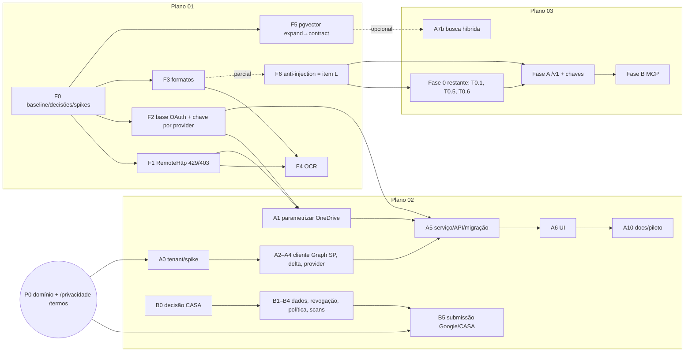

# Integrações — índice dos planos de desenvolvimento

Data: 2026-09-29 · Origem: `specs/research/integracoes-analise-2026-09-29.md` (§1 "Três recomendações", §6 matriz, §7 ondas) · Revisão e integração: pane-243 (missão 25).

> Decisão do dono 29/09: Slack e Teams estão fora de escopo. As Fases C (Slack) e D (Teams) do plano 03 ficam **adiadas** (não canceladas); cronograma, grafo, migrações e pendências abaixo foram refeitos sem elas.
> Decisão do piloto 29/09: Google = Opção A (CASA com `drive.readonly`), contingência `drive.file` + Picker pelos gatilhos G1–G3 — ADR-0017 (`specs/adr/ADR-0017-google-restricted-scope-strategy.md`).

| # | Plano | Frente | Itens do relatório |
|---|---|---|---|
| 01 | [`01-cobertura-e-nucleo.md`](01-cobertura-e-nucleo.md) | Cobertura de formatos + OCR + endurecimento do núcleo | A, B, C, N, **L** |
| 02 | [`02-sharepoint-e-google.md`](02-sharepoint-e-google.md) | Conector SharePoint/M365 + decisão Google CASA × `drive.file`+Picker | E, D |
| 03 | [`03-api-mcp-e-canais.md`](03-api-mcp-e-canais.md) | API pública com chaves + MCP remoto somente leitura (bot Slack e Teams adiados) | F, G (H e M adiados; L consumido do 01) |

**Base de código verificada:** `HEAD` `f5f3a1e` — as alterações que os planos chamavam de "não commitadas" já estão nesse commit. `alembic heads` = `20260929_0018`. `cd backend && .venv/bin/python -m pytest -q tests/unit tests/api` → **459 passed, exit 0** (2026-09-29). Há trabalho **não commitado em andamento** de outra frente (Notion `disconnect`, remoção de pasta do catálogo, UI) que desloca `api/integrations.py` (+8 a partir de `:366`), `integrations/notion.py` (+21 a partir de `:188`) e `library/service.py` (+25 a partir de `:196`). As âncoras dos planos valem para o `HEAD`; ao executar, reancore pelo símbolo.

---

## 1. Visão geral das três frentes

**01 — Chão firme e cobertura (≈ 27,5 dev-dias).** Faz o Arquivio ler o que hoje descarta: XLSX/CSV/TXT/PPTX, Google Sheets/Slides e PDF escaneado (OCR em camadas, pypdf → `docling-serve` → API opcional). Também remove os riscos de núcleo que crescem com esse volume: `RemoteHttp` único com 429/`Retry-After`/backoff e 403-quota × 403-auth, base OAuth única no lugar de três cópias, chave de cifra por provider (hoje o Notion cai na do Google), embeddings em pgvector (hoje o cosseno é calculado em Python sobre JSON) e a cerca anti prompt-injection do RAG. É a **fundação** das outras duas frentes.

**02 — Alcance M365 e destravar o Google (≈ 11,5–16 dev-dias + 4–8 semanas externas).** Parte A: provider `sharepoint` que reaproveita o conector OneDrive (Graph, cifra, serviço OAuth), com ID composto `driveId|itemId`, catálogo Site → Biblioteca → pastas e delta por raiz de biblioteca. Parte B: a trilha é quase toda externa. Recomenda manter `drive.readonly` e começar já a verificação OAuth restrita + CASA, com `drive.file`+Picker como contingência formal (gatilhos G1–G3).

**03 — Distribuição (≈ 17,5–24 dev-dias; Slack e Teams adiados).** Uma camada `access/` transforma qualquer credencial (chave de API, token do MCP) num `Principal` (organização + membro). Os canais chamam os mesmos serviços já escopados. Entregas: Fase 0 (threat model, invariante de escopo), `/v1` com chaves, rate limit e auditoria; MCP remoto somente leitura (`search`/`fetch`) com WorkOS AuthKit (condicionado a spike). Bot Slack (C) e Teams (D) ficam adiados.

Totais: **56,5–67,5 dev-dias** sem opcionais e sem Slack/Teams (relatório: A+B+C+N+L+D+E+F+G ≈ 35–64, sem H). O excedente está justificado em cada plano: hardening, catálogo SharePoint em 3 níveis, revogação/expurgo para o CASA, auditoria e admin de chaves.

---

## 2. Grafo de dependências

Arestas duras: **01-F1 e 01-F2 → 02-A1/A5**, porque os dois tocam `onedrive.py`, `registry.py`, `api/integrations.py` e `tasks.py` e o 02 herda `OAuthConnectionServiceBase`, `RemoteHttp` e `keyring`. **01-F6 → 03** inteiro: `untrusted.py`, `presentation.py` e o corpus são pré-requisitos de `/v1/ask` e MCP. Aresta fraca: 01-F5 → 03-A7b (busca híbrida; a v1 lexical não depende). Não há dependência entre 02 e 03. A Parte B do 02 e 02-A0/A2–A4 não dependem do 01.

---

## 3. Ordem recomendada e paralelismo

**Ordem lógica:** 01 (F0 → F1/F2 → F5 expand → F3 → F4 → F6 → F5 contract) → 02-A (A1/A5 só depois de 01-F1+F2) ∥ 02-B (desde o dia 1) → 03 (Fase 0 restante → A → B).

**Com 2 devs** (S1 = semana de 05/10/2026):

| Semana | Dev A (núcleo → conectores → API/MCP) | Dev B (leitura → Google → canais) | Externo / dono |
|---|---|---|---|
| S0 (30/09–02/10) | — | — | Decidir CASA, domínio, spec 001; disparar lead times (§6) |
| S1 | 01-F0.1/F0.2, **01-F1** | **02-B0–B2** (ADR-0017, mapa de dados, revogação/expurgo); 01-F0.3/F0.4 spikes | cotar labs CASA; publisher verification MS |
| S2 | **01-F2** (base OAuth, keyring, rekey), 01-F5.1–F5.2 | **02-B3/B4** (política Limited Use, scans) → **B5 submissão**; 01-F3.1–F3.2 | revisão jurídica da política |
| S3 | 01-F5.3–F5.8 (expand, dual-write, backfill, flag) | 01-F3.3–F3.8 | Google/CASA em análise |
| S4 | **01-F6** (inclui `presentation.py`); 02-A0.3, A1 | 01-F4.1–F4.4 | — |
| S5 | 02-A2–A4 | 01-F4.5–F4.9; 01-F5 *contract* (≥ 7 d após virar a leitura) | — |
| S6 | 02-A5, A6, A10 (piloto SharePoint) | 03-T0.1/T0.5/T0.6; **03-B0 spike AuthKit (1 d)** | go/no-go AuthKit |
| S7 | 03-A1–A4 | 03-A5–A7 | — |
| S8 | 03-A8a/A8/A9 | 03-A10/A11 | — |
| S9 | 03-B1–B3 | 02-A7–A9 opcionais / folga | — |
| S10–S11 | 03-B4–B6 (clientes reais Claude/ChatGPT) | 03-A7b se F5 contraído / folga | aprovação Google (S6–S10) |

Término previsto com 2 devs: **~11 semanas (até ~18/12/2026)**, mais as esperas externas (Google 4–8 semanas a partir de S2).

**Com 1 dev** (≈ 13–16 semanas + externo), sequência: 01-F0 → **02-B0–B4 e submissão** (tirar o CASA do caminho crítico cedo) → 01-F1 → F2 → F5 (expand) → F3 → F4 → F6 → 02-A → 03-Fase 0 → 03-A → 03-B. Deixe fora 02-A7–A9 e 01-F4.6 (API de OCR); 03-C/D estão adiadas.

**O que roda em paralelo sem conflito:** 02-Parte B com qualquer coisa (quase só docs e UI de revogação). 02-A0/A2/A3/A4 (arquivos novos `integrations/sharepoint*.py`) com 01-F3/F4. 01-F3/F4 (`ingestion/extraction/*`) com 01-F1/F2/F5.

---

## 4. Colisões resolvidas nesta revisão

### 4.1 Migrações Alembic (numeração global)

Os três planos criavam `…_0019` (`pgvector_expand`, `sharepoint_tenant_binding`, `api_access`). Com isso haveria revisões duplicadas e múltiplas cabeças. Alocação esperada, na ordem do cronograma acima:

| Nº | Slug | Plano/tarefa | Semana prevista |
|---|---|---|---|
| 0019 | `library_exclusions` | main (já aplicada; preservada) | — |
| 0020 | `pgvector_expand` | 01-F5.3 | S3 |
| 0021 | `sharepoint_tenant_binding` | 02-A5.1 | S6 |
| 0022 | `extraction_cache` | 01-F4.5 | S5 |
| 0023 | `api_access` | 03-A1 | S7 |
| 0024 | `api_audit_events` | 03-A1 | S7 |
| 0025 | `mcp_connections` | 03-B2 | S9 |
| próx. livre | `org_ocr_consent`, `embedding_hnsw` (condicionais, 01), `provider_settings` (02-A9, se decidido) | — | — |

A cadeia efetivamente entregue é `0018 → 0019 (main) → 0020 → 0021 → 0022 → 0023 → 0024 → 0025`. `pgvector_contract` permanece pendente do gate operacional e deve usar o próximo id livre. Esta tabela prevalece sobre a numeração histórica dos planos.

**Regra que vale sobre a tabela:** o número é o próximo livre e `down_revision` vem da saída de `alembic heads` no dia do merge. Nunca haverá duas revisões com o mesmo `revision`. Antes de mergear, rode `alembic upgrade head --sql` (teste `tests/unit/test_migration_sql.py`) e `upgrade → downgrade -1 → upgrade` em Postgres descartável. O que importa é a cadeia linear. A migração `channels` (03-C1) saiu da alocação com o adiamento do Slack; ao retomá-lo, use o próximo número livre.

### 4.2 ADRs

Os três planos criavam `ADR-0011`. Alocação: **01 → ADR-0011…0015** (formatos/OCR, núcleo HTTP, chave por provider, pgvector, cerca anti-injection); **02 → ADR-0016** (SharePoint) e **ADR-0017** (estratégia de escopo restrito Google); **03 → ADR-0018** (acesso programático). A última existente é `ADR-0010`.

### 4.3 Trabalho duplicado: auditoria anti prompt-injection (item L)

O 01-F6 e a Fase 0 do 03 especificavam o mesmo `backend/app/knowledge/untrusted.py` com APIs diferentes, dois corpora (`injection_cases.json` × `prompt_injection.json`) e duas guardas de saída (`strip_links` novo × extrair a sanitização existente de `api/ingestion.py:467-563`). Consolidação:

- **O 01-F6 é o dono único.** T6.1 = corpus único `injection_cases.json`, com os 6 casos do 03. T6.2 = `untrusted.py`, que exporta `fence_sources`, `strip_invisible`, `safe_label`, o alias `sanitize_label` e `UNTRUSTED_NOTICE`, e aplica L-7/L-8. T6.3 = extração de `knowledge/presentation.py` (a antiga 03-T0.4) mais o tratamento de imagens markdown. F6 passa de 3 para 3,5 d.
- **O 03 fica com T0.1** (threat model de API/MCP/canais), **T0.5** (invariante de escopo) e **T0.6** (relatório). A Fase 0 cai de 3–4 para 1,5–2 d.
- Fato corrigido no 01 (E15 e tabela da F6): **já existe** filtro de links/URLs no servidor, mas só na serialização HTTP (`_answer_without_source_links`, `api/ingestion.py:507-563`).

### 4.4 Arquivos tocados por mais de um plano (ordem de merge)

| Arquivo | Quem toca | Regra |
|---|---|---|
| `backend/app/integrations/onedrive.py` | 01-F1.4, F2.3, F2.6, F3 (extração) · 02-A1 | 01 primeiro; 02-A1 rebase sobre a base OAuth (`provider`, não `provider_key`) |
| `backend/app/integrations/registry.py`, `api/integrations.py` | 01-F2.2/F2.6/F2.8 · 02-A5.2/A8 · WIP Notion disconnect | 01 primeiro; o WIP do Notion torna vermelho→verde imediato os passos 1–2 de 01-T2.2 |
| `backend/app/ingestion/tasks.py` | 01-F1.6, F3.6, F4.4 · 02-A5 | 01 → 02 |
| `backend/app/core/config.py`, `backend/pyproject.toml`, `alembic/env.py` | os três | um bloco de settings/deps por plano, sem reordenar os existentes |
| `backend/app/knowledge/questions.py`, `agent.py`, `api/ingestion.py` | 01-F5.6, F6 · 03-A7/A8a | 01-F6 antes de 03-A |
| `frontend/app/product-app.tsx` | 01-T3.8 · 02-A6 · 03-A10 · WIP atual | alterações pequenas e isoladas; rebase a cada merge |
| `frontend/app/privacidade/page.tsx` | 02-B3 | uma revisão jurídica cobrindo Google Limited Use, SharePoint e sub-processadores (rascunho: `docs/legal/google-politica-privacidade-rascunho.md`) |
| `specs/001-mvp-document-intelligence.md`, `docs/integrations-roadmap.md` | os três | emenda do spec 001 em S0/S1 (formatos/OCR) e em S6 (API/MCP) |

---

## 5. Decisões pendentes do dono (com prazo)

| # | Decisão | Recomendação dos planos | Prazo | Bloqueia |
|---|---|---|---|---|
| 1 | **Google: CASA (`drive.readonly`) × `drive.file` + Picker**, teto de orçamento do lab, "ponte" do piloto (Testing/app não verificado/Trusted) — ADR-0017 | Opção A (CASA agora), B só com os gatilhos G1–G3 | **DECIDIDO 29/09: Opção A** (ADR-0017); pendem só teto do lab e ponte do piloto — **02/10/2026** (S0): cada semana de atraso empurra a aprovação (4–8 sem) | 02-B5, go-to-market Google > 100 usuários |
| 2 | **Emenda do spec 001**: mover TXT/CSV/XLSX/PPTX/Sheets/Slides e OCR de PDF para "Incluído" (`:48`, `:56-60`); depois, tirar API/MCP de "fora de escopo" | Sim, com as exclusões de legados, imagens soltas e planilhas complexas | formatos/OCR: **09/10/2026** (fim de S1, antes de 01-F3); API/MCP/Slack: **13/11/2026** (S6) | 01-F3/F4; 03 |
| 3 | **AuthKit como AS do MCP**: habilitar AuthKit/Connect (CIMD, Resource Indicators, DCR) no ambiente de teste da WorkOS, aceitar o custo do plano e decidir GO / Plano B (AS próprio, +5–8 d) / Plano C (chave estática) | GO condicionado ao spike 03-B0 (`sub` == `AuthIdentity.provider_subject`?) | habilitar até **06/11/2026**; go/no-go até **13/11/2026** (S6) | 03-B1+ |
| 4 | Domínio próprio (P0 do 02) | registrar/apontar e publicar `/privacidade` e `/termos` | **02/10/2026** | Google, Microsoft publisher verification, `api.`/`mcp.` do 03 |
| 5 | Motor de OCR (01-D3) e uso de API externa de OCR (DPA/sub-processadores) | `docling-serve` sidecar; API externa só com DPA | **16/10/2026** (antes de 01-F4.3) | 01-F4.3/F4.6 |
| 6 | Chave própria do Notion obrigatória em produção (01-D6); pgvector sem ANN no 1º release (01-D7) | sim / sim | **09/10/2026** | 01-F2.6, F5.8 |
| 7 | Retenção (TTL) da auditoria e das sessões; cota da API dentro das 1.000 perguntas/mês | definir TTL; mesma cota | **20/11/2026** (antes de 03-A5 em produção) | 03-A5, `/v1/ask` |

---

## 6. Lead times externos para disparar já (S0)

1. **Domínio + páginas públicas** (`/privacidade`, `/termos`): hoje o frontend vive em `*.up.railway.app` e as páginas davam 404 em 28/09. Pré-requisito de tudo abaixo.
2. **Google:** verificação de marca (2–3 d) → verificação de escopo restrito → **CASA Tier 2** com lab (cotar 2–3 labs por escrito; 4–8 semanas; reverificação anual).
3. **Microsoft:** Microsoft AI Cloud Partner Program (ID) + **publisher verification** (domínio verificado); tenant de teste M365 (Developer Program) para o spike A0.1; roteiro de admin consent do cliente-âncora.
4. **Postgres com pgvector** em cada ambiente (Render/Railway/Oracle-compose): confirmar `CREATE EXTENSION vector` e a versão (≥ 0.8 para `iterative_scan`) antes de S3.
5. **docling-serve:** dimensionamento de memória/CPU no provedor (serviço extra) antes de S4.
6. **WorkOS AuthKit/Connect** habilitado no ambiente de teste para o spike 03-B0 (S6).
7. **Jurídico/LGPD:** política de privacidade com Limited Use do Google, SharePoint e sub-processadores; DPA do fornecedor de OCR, se houver (01-P5).

---

## 7. Documentação necessária (consolidada)

### 7.1 Externa (URLs completas nos planos: 01 §14.1, 02 §7(a), 03 §9(a))

| Frente | Documentos essenciais |
|---|---|
| Formatos | [pypdf](https://pypdf.readthedocs.io/en/stable/) · [openpyxl read-only](https://openpyxl.readthedocs.io/en/stable/optimized.html) · [python-pptx](https://python-pptx.readthedocs.io/en/latest/) · [python-docx](https://python-docx.readthedocs.io/en/latest/) · [Drive export formats](https://developers.google.com/workspace/drive/api/guides/ref-export-formats) |
| OCR | [Docling](https://docling-project.github.io/docling/) · [docling-serve](https://github.com/docling-project/docling-serve) · [Azure Read](https://learn.microsoft.com/en-us/azure/ai-services/document-intelligence/prebuilt/read) · [Google Document AI OCR](https://cloud.google.com/document-ai/docs/process-documents-ocr) |
| Núcleo HTTP/erros | [RFC 9110 Retry-After](https://www.rfc-editor.org/rfc/rfc9110#name-retry-after) · [Drive handle errors](https://developers.google.com/workspace/drive/api/guides/handle-errors) · [Graph throttling](https://learn.microsoft.com/en-us/graph/throttling) · [Notion request limits](https://developers.notion.com/reference/request-limits) · [Fernet/MultiFernet](https://cryptography.io/en/latest/fernet/) |
| pgvector | [pgvector](https://github.com/pgvector/pgvector) · [pgvector-python](https://github.com/pgvector/pgvector-python) · [Render extensions](https://render.com/docs/postgresql-extensions) · [Railway pgvector](https://railway.com/deploy/postgres-with-pgvector-engine) |
| Prompt injection | [OWASP LLM01](https://genai.owasp.org/llmrisk/llm01-prompt-injection/) · [OWASP cheat sheet](https://cheatsheetseries.owasp.org/cheatsheets/LLM_Prompt_Injection_Prevention_Cheat_Sheet.html) · [Lethal trifecta](https://simonwillison.net/2025/Jun/16/the-lethal-trifecta/) |
| SharePoint/Entra | [driveItem delta](https://learn.microsoft.com/en-us/graph/api/driveitem-delta) · [Selected permissions](https://learn.microsoft.com/en-us/graph/permissions-selected-overview) · [permissions reference](https://learn.microsoft.com/en-us/graph/permissions-reference) · [admin consent](https://learn.microsoft.com/en-us/entra/identity-platform/v2-admin-consent) · [publisher verification](https://learn.microsoft.com/en-us/entra/identity-platform/publisher-verification-overview) · [SharePoint throttling](https://learn.microsoft.com/en-us/sharepoint/dev/general-development/how-to-avoid-getting-throttled-or-blocked-in-sharepoint-online) |
| Google verificação | [Restricted scope verification](https://developers.google.com/identity/protocols/oauth2/production-readiness/restricted-scope-verification) · [Drive scopes](https://developers.google.com/workspace/drive/api/guides/api-specific-auth) · [User Data Policy / Limited Use](https://developers.google.com/terms/api-services-user-data-policy) · [CASA Tier 2](https://appdefensealliance.dev/casa/tier-2/tier2-overview) · [Picker](https://developers.google.com/workspace/drive/picker/guides/overview) |
| MCP | [Authorization 2025-11-25](https://modelcontextprotocol.io/specification/2025-11-25/basic/authorization) · [Security best practices](https://modelcontextprotocol.io/specification/2025-11-25/basic/security_best_practices) · [changelog 2026-07-28](https://modelcontextprotocol.io/specification/2026-07-28/changelog) · [python-sdk](https://github.com/modelcontextprotocol/python-sdk) · [Claude connectors](https://claude.com/docs/connectors/building.md) · [OpenAI MCP](https://developers.openai.com/api/docs/mcp) · [WorkOS AuthKit MCP](https://workos.com/docs/authkit/mcp) |
| Slack/Teams (adiados) | [Bolt for Python](https://docs.slack.dev/tools/bolt-python/) · [Events API](https://docs.slack.dev/apis/events-api/) · [Rate limits](https://docs.slack.dev/apis/web-api/rate-limits) · [Marketplace guidelines](https://docs.slack.dev/slack-marketplace/slack-marketplace-app-guidelines-and-requirements) · [teams.py](https://github.com/microsoft/teams.py) · [Agents SDK migration](https://learn.microsoft.com/en-us/microsoft-365/agents-sdk/bf-migration-guidance) |

Os planos marcam quais URLs foram abertas e quais só foram citadas (01: "conferir"; 02: ✅/◻; 03: [ok]/[lk]). As marcadas como não abertas precisam ser lidas antes de virar fonte de decisão.

### 7.2 Interna — criar ou atualizar

| Documento | Plano/tarefa |
|---|---|
| `specs/adr/ADR-0011-formatos-e-ocr.md` · `ADR-0012-nucleo-http-e-erros-remotos.md` · `ADR-0013-chave-por-provider.md` · `ADR-0014-pgvector.md` · `ADR-0015-cerca-anti-prompt-injection.md` | 01-T0.2 |
| `specs/adr/ADR-0016-sharepoint-connector.md` · `ADR-0017-google-restricted-scope-strategy.md` | 02-A10, 02-B0 |
| `specs/adr/ADR-0018-acesso-programatico.md` | 03-A1 |
| `specs/001-mvp-document-intelligence.md` (emenda) | 01-T0.2; 03 (fim) |
| `specs/research/baseline-2026-09-29.md`, `ocr-spike-2026-09.md`, `pgvector-spike-2026-09.md` | 01-T0.1/T0.3/T0.4 |
| `docs/operacao/ocr-runbook.md`, `pgvector-runbook.md`, `chaves-por-provider.md`; atualizar `sync-credenciais-retencao-recomendacao.md` | 01-F2.7/F4.7/F5 |
| `docs/seguranca/prompt-injection-rag.md` (01-T6.6) · `threat-model-api-mcp-canais.md` (03-T0.1) · `auditoria-prompt-injection-2026-09.md` (03-T0.6) · `casa-evidencias.md` (02-B4) | 01/02/03 |
| `docs/integracoes/sharepoint-spike-tenant-teste.md`, `sharepoint-runbook-consentimento-admin.md`, `google-oauth-verificacao-checklist.md`, `google-picker-poc.md` (contingência) | 02 |
| `docs/legal/google-api-data-use-declaracao.md` | 02-B5 |
| `docs/api/referencia-v1.md`, `openapi-v1.json`, `versionamento.md`, `CHANGELOG.md` | 03-A11 |
| `docs/integracoes/claude-e-chatgpt.md`; `docs/deployment/mcp-server.md`; `docs/spikes/mcp-authkit-2026-10.md` | 03-B |
| Atualizar: `docs/agent-flow.md`, `docs/integrations-roadmap.md`, `docs/deployment/{railway-production,free-pilot-render,oracle-always-free}.md`, `README.md`, `frontend/app/privacidade/page.tsx`, `.env*.example` | os três |

---

## 8. Riscos principais (consolidados)

| # | Risco | Plano | Mitigação |
|---|---|---|---|
| R1 | **Google reprova ou atrasa o CASA**, ou o custo sai da faixa (US$ 0,5–6 mil × até 75 mil/ano nas fontes) | 02 | decidir em S0; cotação escrita; gatilhos G1–G3 → PoC Picker de 1 d; ponte do piloto |
| R2 | **Vazamento entre tenants** por API/MCP | 03 | `Principal` único, testes de 2 tenants por canal, 404 uniforme, invariantes I-1…I-6 |
| R3 | **Prompt injection** via documento em LLM de terceiros (Claude/ChatGPT) ou em canal público | 01-F6, 03 | cerca com nonce, `strip_invisible`, guarda de saída única (`presentation.py`), só leitura, respostas efêmeras |
| R4 | **pgvector** indisponível ou sem privilégio de extensão no Postgres gerenciado; *contract* prematuro | 01 | checar em S0; expand/dual-write/flag; contract só depois de 7 dias sem divergência, com dump |
| R5 | **Volume e custo** de planilhas/PPTX/OCR estouram os tetos (500 docs, 1 M tokens, lease de 20 min) | 01 | tetos por documento, truncamento com aviso, orçamento `ocr_pages`, flags por release |
| R6 | **Conflitos de merge** em `onedrive.py`/`registry.py`/`api/integrations.py`/`tasks.py` e numeração de migração | 01/02/03 | ordem do §4.4 e regra "próximo número livre + `alembic heads`"; WIP atual do Notion antes de 01-F2 |
| R7 | **AuthKit** não cobre organização/`sub` como esperado | 03 | spike B0 em S6; Planos B (+5–8 d) e C |
| R8 | *(adiado)* Revisão do Slack Marketplace: fora de escopo por decisão do dono | 03 | ver Fases C/D adiadas |
| R9 | **SharePoint delegado depende de uma pessoa** (admin conector sai → `reauth_required`); o consentimento de admin varia por tenant | 02 | runbook de consentimento; `Sites.Selected` (A9); modo aplicativo depois |
| R10 | **403 de item no Graph derruba a fonte inteira**: 01-T1.4 delega a distinção ao 02, que não a cobria | 02 | teste em A3: 403 `accessDenied` num item ⇒ documento `failed`, fonte `connected` |
| R11 | **Estimativas acima do relatório** (01 ≈ teto; 02-A 6,5–9 × 3–5; 03 22,5–32 × 17–30) | todos | fatias entregáveis por release e opcionais cortáveis (02-A7–A9, 01-F4.6, 03-B7/D) |
| R12 | **Retenção da auditoria indefinida** | 03 | decisão nº 7 antes de habilitar em produção |

---

## 9. Verificação desta revisão

- **Âncoras `path:line`:** extraí automaticamente 151 (01), 92 (02) e 89 (03) referências únicas. Todos os arquivos existem. Conferi manualmente o conteúdo de 26 (01), 22 (02) e 30 (03) referências contra o `HEAD` `f5f3a1e`. As erradas foram corrigidas no próprio plano, com a marca "Revisão".
- **Símbolos/tabelas:** `ExtractedBlock` (`ingestion/service.py:69-75`), `DiscoveredDocument`, `ELIGIBLE_MIME_TYPES`, `CredentialCipher`, `OneDriveCipher`, `GoogleConnectionService`/`OneDriveConnectionService`/`NotionConnectionService`, `ALLOWED_TOOLS`/`INTENT_SCHEMA`, `AgentRequest`, `LibraryToolExecutor`, `WorkOSAuthKitGateway`, `JsonFormatter.fields`, `audit_logs`, `DataSource.provider String(40)` e `CHUNK_TARGET_TOKENS=500`/`CHUNK_OVERLAP_TOKENS=60` existem como descrito.
- **Alembic:** `backend/.venv/bin/python -m alembic heads` → `20260929_0018 (head)`.
- **Comandos de teste:** `.venv/bin/python -m pytest -q tests/unit tests/api` → 459 passed (exit 0). `pytest` puro não está no PATH e `python -m pytest` usa o Python do sistema, sem `fastapi`. Notas foram adicionadas em 02 e 03. Não há `.github/` (sem CI): os critérios "CI falha se…" do 03 (AC-8/AC-10) exigem criar o CI ou rodar o script manualmente. `graphify` não está instalado.
